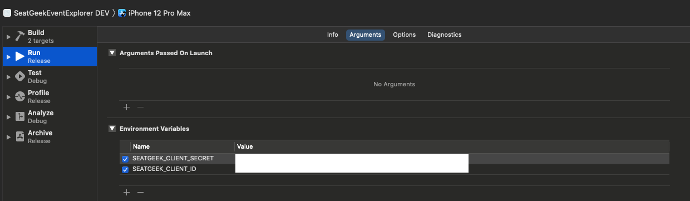

# SeatGeek Event Explorer App

This app uses the SeatGeek API to display various live events to the user. It features live search, which fetches relevant events while typing in the search bar, as well as event favoriting that persists between launches.

## Table of Contents

1. [Building the Project](#building-project)
2. [Architecture](#architecture)
3. [Things I'd do Differently](#things-differently)

##  Building the Project

This app doesn't depend on any third party libraries and should build normally on its own. To make the network requests to the SeatGeek API, credentials must be provided to the scheme that the app is running on to gain access to the SeatGeek API. Once the credentials are added to the scheme, the app should run like normal.

Here's how you can put your credentials into the scheme:

1. Get a `client_id` and `client_secret` by signing up for a SeatGeek developer account. More info here: [platform.seatgeek.com](https://platform.seatgeek.com)
2. Open the Xcode project and navigate to Edit Scheme

   
3. Navigate to the Run -> Arguments tab
4. Enter the SeatGeek client secret into an environment variable named `SEATGEEK_CLIENT_SECRET`
5. Enter the SeatGeek client id into an environment variable named `SEATGEEK_CLIENT_ID`

5. The project should now work normally!

##  Architecture

The main architecture of the app follows the MVC design pattern, along with the Coordinator pattern for navigation.

#### Notes

1. [Network Layer](#network-layer)
2. [On-Device Persistence](#on-device-persistence)
3. [Event List Screen](#event-list-screen)
4. [Event Detail Screen](#event-detail-screen)

####  Network Layer

This app has a heavy focus on networking for consuming event data from the SeatGeek API, as well as images associated with those events. I created protocols such as `LiveEventRetrieving` and `ImageRetrieving` to help decouple the networking code from the models used in the screens, which made it easy to unit test using mocks. `SeatGeekNetworkService` implements both of these retrieving protocols, and is used in the application code for performing all network requests.

####  On-Device Persistence

One of the goals of this app was to enable users to favorite events and have them persist between application launches. I implemented `DiskStorageService`, which has a local `store` property that keeps track of event IDs that have been favorited, and has a method `saveLocalStoreToDisk()` which bundles up the store values and saves it on the user's device. When this class is initialized, it loads any saved data from user's device into itself.

####  Event List Screen

##### LiveEventListTableViewController

To help mitigate the "Massive-View-Controller" problem, I compartmentalized different duties of the table view controller into their own classes that the table view controller consumes. For example, instead of implementing the `TableViewDataSource` protocol on the table view controller class itself, I created the `LiveEventListDataSource` object which implements the data source protocol.

##### LiveEventListManager

This class is feeds data to the list data source. It is unit tested, through the use of mocked classes for the networking components. This class also uses the delegate pattern to communicate updates about its local property of events.

###### Live Search

The live search feature is possible by `UISearchController` and the `refreshLiveEvents(with:)` method of `LiveEventListManager`. By utilizing the `searchResultsUpdater` property of `UISearchController`, we can get updates each time the user types a new letter. On each update, I perform a network request using the `refreshLiveEvents(with:)` method which shows the effect of results being filtered in real time when searching.

####  Event Detail Screen

##### LiveEventDetailsViewController

This screen is relatively simple, so it contains all of its controller logic in the single view controller. The heart bar button was made by subclassing `UIButton` and then instantiating a `UIBarButton` instance with it as a custom view.

##### LiveEventDetailsManager

Stores the event for the details view controller, as well as provides functionality to favorite and unfavorite the current event using `DiskStorageService`.

##  Things I'd do Differently

1. Add loading indicators when network requests are active. I think it can be confusing to users when a network request might be taking longer than expected but they have no feedback on the UI to indicate that's the case.
2. Implement an image cache for images received from the network. To be more considerate of the user's data as well as be faster, I think a robust image cache would be a good feature.
3. Look into CoreData for on-device persistence if the data to persist was going to increase in complexity. The current system works well for simple data types, but using a well documented system like CoreData would be better for future expansion.
